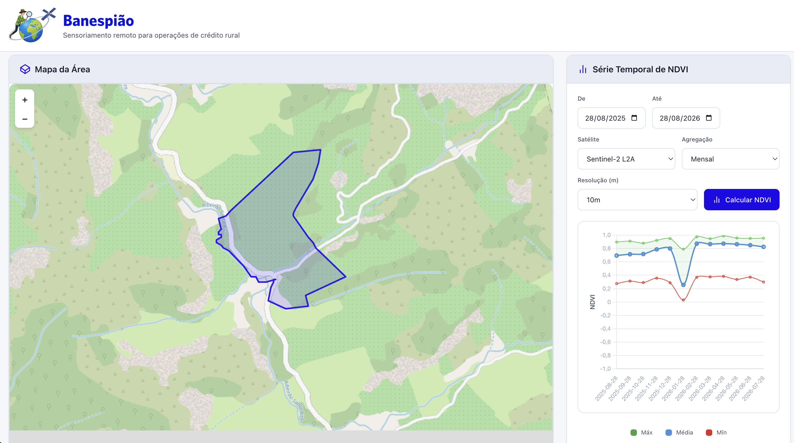
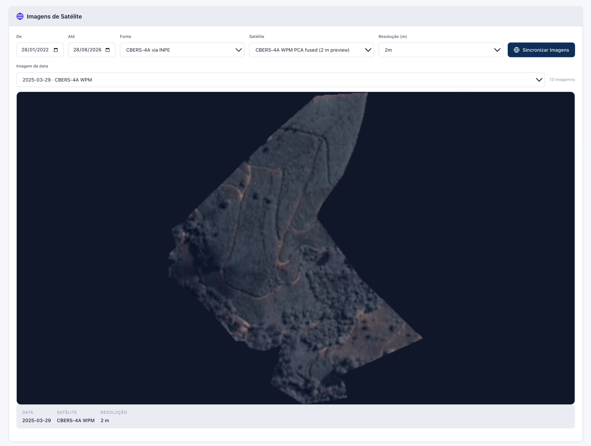
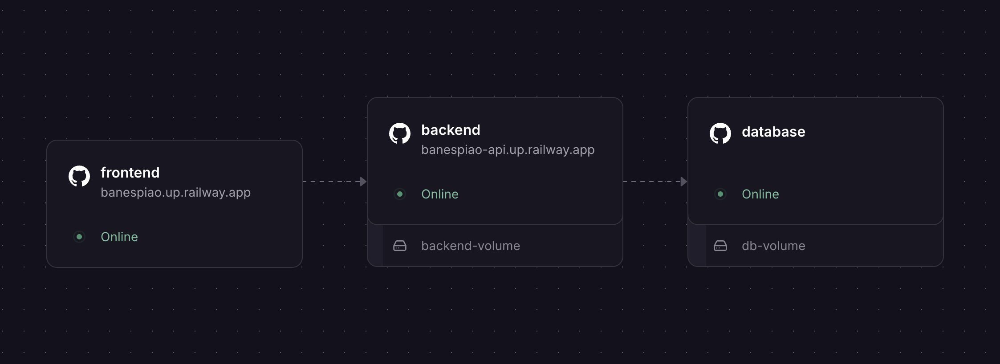

<p align="center">
  
</p>

Protótipo para plataforma de monitoramento de vegetação por imagens de satélite. Permite upload de áreas via KML, cálculo de séries temporais de NDVI e obtenção de imagens de satélite em cores verdadeiras a partir do Copernicus Data Space Ecosystem (CDSE) e Instituto Nacional de Pesquisas Espaciais (INPE).

## Funcionalidades

### Mapa e série temporal de NDVI

Após importação do `.kml`, a área é plotada no mapa Leaflet. O usuário pode então obter a série temporal de NDVI diretamente da API do Copernicus Data Space Ecosystem (CDSE), podendo escolher:

- Intervalo de datas
- Satélites
  - Sentinel 2
  - Landsat 8-9
- Resolução
  - 10m
  - 20m
  - 30m
  - 100m
- Agregação
  - Diário
  - Semanal
  - Mensal
  - Anual

O gráfico plotado contém 3 linhas: máximo, média e mínimo. Como é obtido um índice para cada pixel válido na imagem, esses valores se referem, considerando o período de agregação, o valor máximo encontrado, o valor médio e o valor mínimo.



### Download de imagens de satélites

A aplicação permite download e persistência de imagens das seguintes coleções:

- Sentinel-2 L2A (CDSE)
  - 10m
  - 20m
  - 30m
  - 100m
- Landsat 8-9 OLI/TIRS L1 (CDSE)
  - 30m
  - 100m
- CBERS-4A WPM PCA fused (INPE)
  - 2m



## Arquitetura



```
banesensor/
├── backend/          # API R (plumber2) + workers assíncronos (mirai)
├── frontend/         # Aplicação Angular 22 + Leaflet + Chart.js
├── db/               # PostgreSQL 16 + extensão PostGIS
└── docker-compose.yml
```

No banco de dados, são guardadas as séries temporais de NDVI e os metadados das imagens. Os `.png` em si são guardados em `/app/uploads` (em um volume anexado, no caso do Railway).

## Stack

| Camada     | Tecnologias |
|------------|-------------|
| Backend    | R 4.6, plumber2, mirai, CDSE, rsi, rstac, sf, terra |
| Frontend   | Angular 22, Leaflet, Chart.js (ng2-charts) |
| Banco      | PostgreSQL 16 + PostGIS |
| Infra      | Docker Compose |

## Pré-requisitos

- Docker e Docker Compose (para build local)
- Conta gratuita no [Copernicus Data Space Ecosystem](https://dataspace.copernicus.eu/) com credenciais OAuth (client ID e secret)

## Variáveis de ambiente

Crie um arquivo `.env` na raiz do projeto:

```env
CDSE_ID=seu_client_id
CDSE_SECRET=seu_client_secret

DB_NAME=seu_db_name
DB_USER=seu_db_user
DB_PASSWORD=seu_db_password

ASYNC_WORKERS=4 (mude para 1, caso use um serviço limitado em RAM)
```

## Como executar

```bash
docker compose up
```

| Serviço  | URL |
|----------|-----|
| Frontend | http://localhost:4200 |
| API      | http://localhost:8000 |
| Banco    | localhost:5432 |

## Deploy no Railway

O projeto é um monorepo com três serviços (`backend/`, `frontend/` e `db/`), cada um capaz de ser deployado como um serviço separado no Railway. Cada diretório contém um `railway.json` que configura o builder `DOCKERFILE` e healthchecks.

### Passo a passo

1. **Crie um projeto no Railway** e conecte-o ao repositório GitHub.
2. **Crie três serviços** (Source → GitHub → selecione o repositório):
   - **Database** — Root Directory: `db`, nome de serviço sugerido: `database`
   - **Backend** — Root Directory: `backend`, nome de serviço sugerido: `backend`
   - **Frontend** — Root Directory: `frontend`, nome de serviço sugerido: `frontend`

3. **Banco de dados**: o serviço `db/` usa a imagem `postgis/postgis:16-3.4`. Anexe um **Volume** ao serviço para persistência (Railway montará o volume automaticamente). O `init.sql` cria as tabelas e a extensão PostGIS na primeira inicialização.

4. **Env vars do Backend**:
   | Variável | Valor |
   |----------|-------|
   | `CDSE_ID` | seu client ID do CDSE |
   | `CDSE_SECRET` | seu client secret do CDSE |
   | `DB_HOST` | hostname interno do serviço de banco (ex.: `database`) |
   | `DB_PORT` | `5432` |
   | `DB_NAME` | `banesensor` (ou nome do banco) |
   | `DB_USER` | usuário do Postgres (padrão da imagem: `postgres`) |
   | `DB_PASSWORD` | senha do Postgres configurada na imagem |
   | `UPLOAD_DIR` | `/app/uploads` (e anexe um Volume neste path para persistir imagens) |
   | `ASYNC_WORKERS` | `4` (opcional, mude para 1 se serviço limitado em RAM) |

5. **Env var do Frontend**:
   | Variável | Valor |
   |----------|-------|
   | `BACKEND_URL` | URL da API backend via **Private Network** (ex.: `http://backend.railway.internal:8000`) |

   O nginx renderiza `default.conf.template` via `envsubst` no boot, injetando `BACKEND_URL` no `proxy_pass`. **Importante:** use o hostname privado `http://<serviço>.railway.internal:<porta>` (porta padrão do backend é `8000`). Não use a URL pública do backend (`https://...up.railway.app`): como o nginx preserva o header `Host` do frontend, o edge do Railway rotearia a requisição de volta para o frontend, causando loop e erro `502 upstream sent too big header`.

6. **Networking**: o frontend e o backend devem compartilhar o mesmo **Private Network** do Railway para que resolvam os hostnames internos (o que acontece por default, usando os 3 serviços no mesmo projeto).

7. **Deploy**: o Railway detecta os `railway.json` automaticamente. Após o deploy, use o domínio público gerado para o serviço `frontend`.

### Volumes necessários

- Serviço `database`: volume no path de dados do Postgres (definido pela imagem; no postgis é `/var/lib/postgresql/data`).
- Serviço `backend`: volume em `UPLOAD_DIR` para persistir as imagens baixadas.

## API

### Áreas

| Método | Endpoint | Descrição |
|--------|----------|-----------|
| `GET` | `/api/areas` | Lista todas as áreas |
| `GET` | `/api/areas/<id>` | Retorna uma área com geometria |
| `POST` | `/api/areas/upload` | Upload de KML para criar área |
| `DELETE` | `/api/areas/<id>` | Remove área e dados associados |

### NDVI

| Método | Endpoint | Descrição |
|--------|----------|-----------|
| `POST` | `/api/ndvi/<id>` | Calcula série temporal de NDVI (assíncrono) |
| `GET` | `/api/ndvi/<id>` | Retorna série temporal em cache |

### Imagens de satélite

| Método | Endpoint | Descrição |
|--------|----------|-----------|
| `POST` | `/api/image/<id>` | Sincroniza imagens RGB (assíncrono) |
| `GET` | `/api/image/<id>` | Lista metadados das imagens em cache |
| `GET` | `/api/image/<id>/file/<image_id>` | Retorna imagem PNG |

### Coleções disponíveis

| Método | Endpoint | Descrição |
|--------|----------|-----------|
| `GET` | `/api/collections` | Lista coleções de satélite disponíveis |

## Coleções suportadas

- **Sentinel-2 L2A** (`sentinel-2-l2a`) — MSI, correção atmosférica
- **Landsat 8-9 Collection 2 L2** (`landsat-c2-l2`) — OLI/TIRS, reflectância superficial
- **CBERS-4A WPM** (`CB4A-WPM-PCA-FUSED-1`) — via STAC/INPE

## Banco de dados

Tabelas principais:

- `areas` — Áreas de interesse com geometria PostGIS
- `ndvi_time_series` — Séries temporais de NDVI
- `satellite_images` — Metadados das imagens de satelite baixadas
